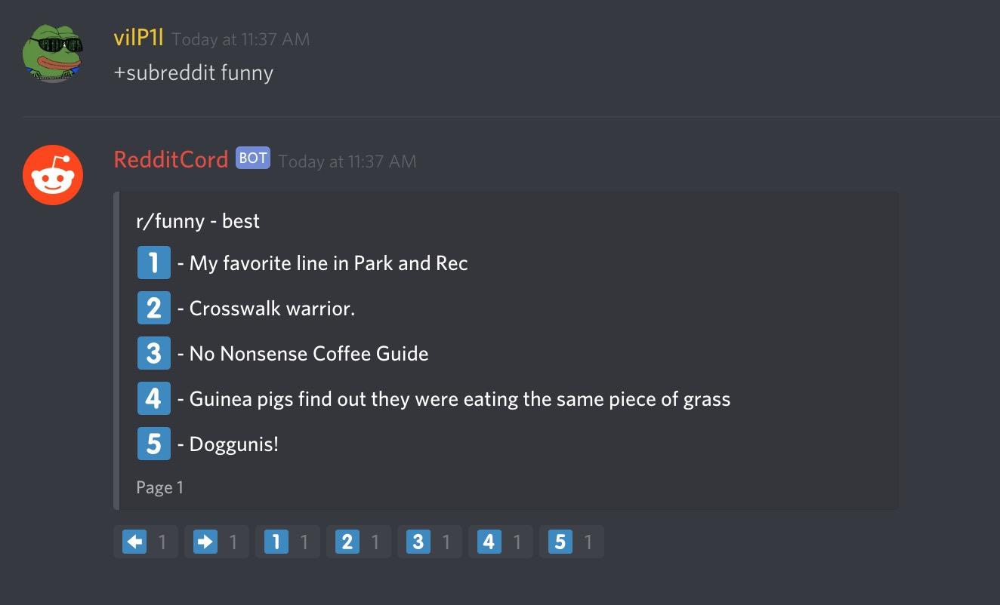
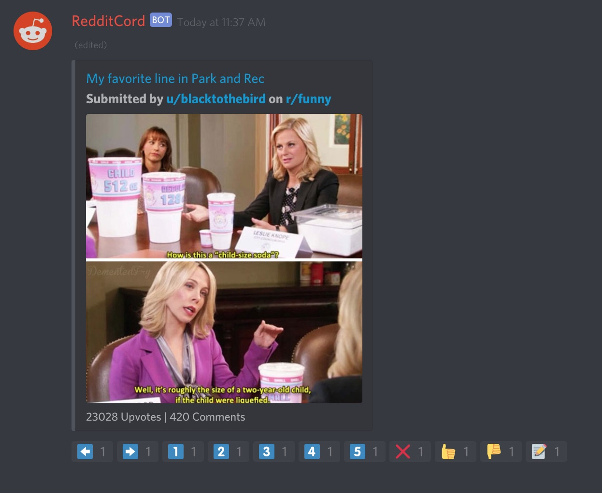
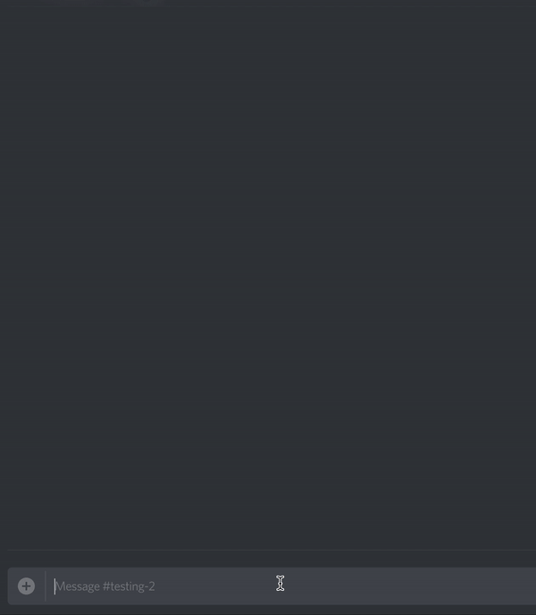
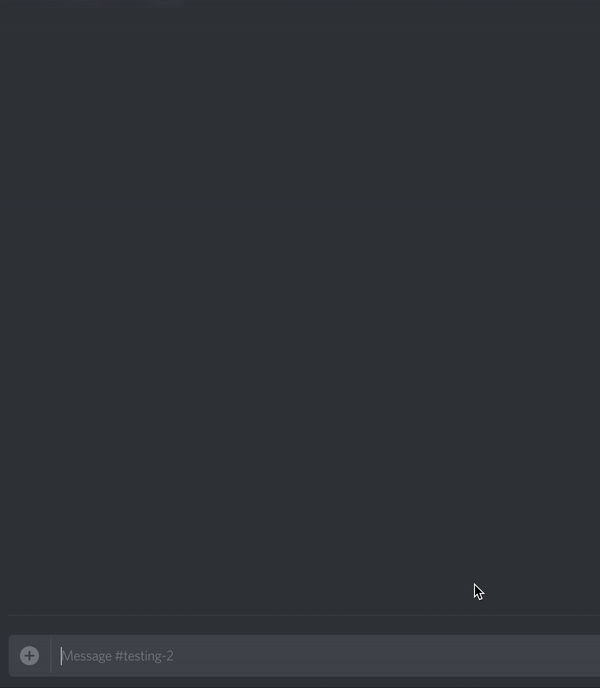
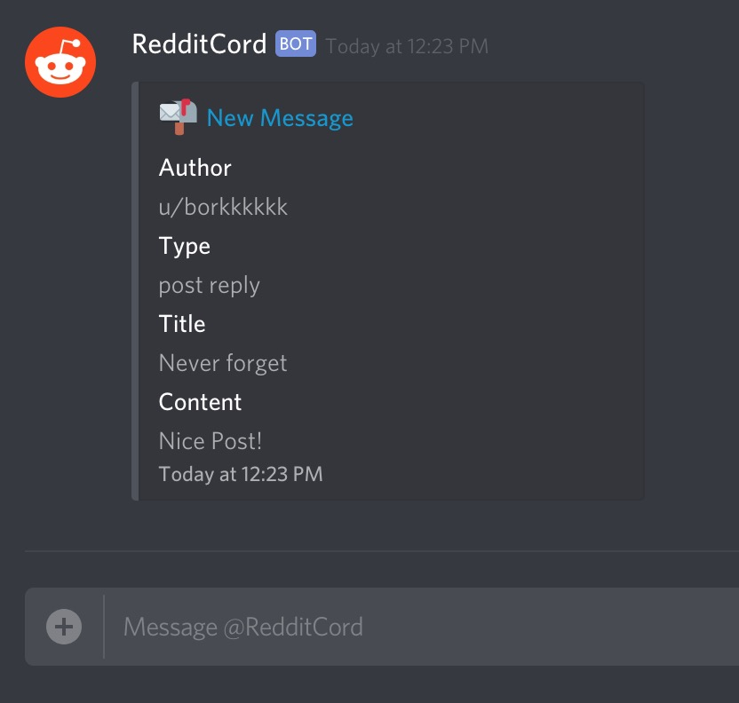

# RedditCord

Discord Reddit client created for Discord Hack Week
[**Discord Server**](https://discord.gg/H5kCpg4)
[**Invite Link**](https://discordapp.com/api/oauth2/authorize?client_id=592798439751024650&permissions=1073752128&scope=bot)

## Features

### Subreddit Browsing

### Post Viewing

### Voting

### Commenting

### Posting

## Sending Private Messages

### Notifications

## Team

### vilP1l#0001

- Lead developer
- Testing

### SpotiKona#0001

- Developer
- Testing

### its a-me markio#9733

- Minor additions
- Testing

## Setup

Step #0: Install [Node.js](https://nodejs.org/).

Step #1: Open a shell & navigate to the directory where you have cloned the code.

Step #2: To install the required dependencies, run `npm install`.

Step #3: To compile to code, run `npm run build`.
You should notice that a new folder has appeared. This folder contains the compiled code.

Step #4: Create a new file called `config.json`. Use `config-example.json` as a guide.

Step #5: Create a Discord [bot](https://discordapp.com/developers/applications). From there, locate the bot token & add it to `config.json`.

Step #6: Locate your Discord ID & add it to the array of owner ID's. This will unlock privileged commands, such as `eval` & `reload`.

Step #6: You will need to create a Mongo [database](https://www.mongodb.com/download-center/community) to store Reddit authentication tokens.
The information used to configure Mongo can then be added to `config.json`. 

Step #7: Create a Reddit [application](https://www.reddit.com/prefs/apps). Set the type as: "web app." Create a Reddit OAuth URL using this [guide](https://github.com/reddit-archive/reddit/wiki/oauth2). The following scopes are required: identity, submit, subscribe, vote, mysubreddits, read, edit, & privatemessages. For the state, use "USERID." For the authorization token, head to this [website](https://www.base64encode.org/). Encode `YOUR_APP_ID:YOUR_APP_SECRET`, then paste the encoded string into `config.json`.

Step #8: Set up the web server. Set the port/host. The default endpoints & more can be found in `WebServer.js` located @ `src/Classes`.

Step #9: To start the bot, run `node lib/index.js`!

If you need any help following these instructions, feel free to message either vilP1l#0001 or SpotiKona#0001 on Discord. Please refrain from creating a GitHub issue unless there is an actual issue that needs to be addressed.
